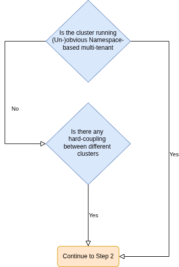
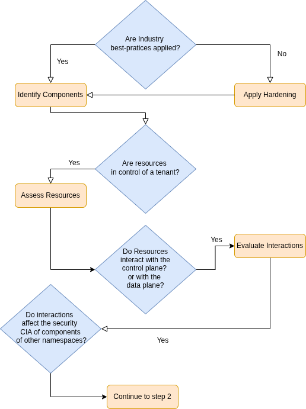
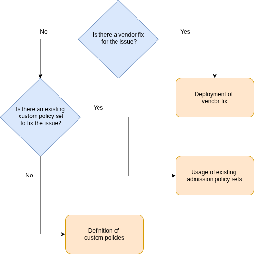

# Methodology for Assessing Namespace-Based Multi-Tenancy Setups

This page introduces our structured methodology for assessing security risks in Kubernetes environments that use Namespace-based Multi-Tenancy. It addresses weaknesses that break Namespace-based isolation that not well studied, yet. We found this issues during our research and presented them together with this methodology in our [Talk at KubeCon + CloudNativeCon Europe 2026](https://kccnceu2026.sched.com/event/2CW2U/how-to-break-multi-tenancy-again-and-again-and-what-we-can-learn-from-it-lorin-lehawany-sven-nobis-ernw?iframe=yes&w=100%&sidebar=yes&bg=no).

The methodology assumes that industry best practices, such as NetworkPolicies, Role-Based Access Control (RBAC), and Pod Security Standards, are already in place. These measures provide a necessary baseline level of protection against well-known isolation threats. However, they are insufficient to address a class of more subtle attack vectors arising from interactions between tenants and shared components. Such attack vectors may still compromise the confidentiality, integrity, and availability (CIA) of the cluster and its workloads, even in well-hardened environments.

The approach consists of three sequential phases:

1. Determining whether Namespace-based Multi-Tenancy is present in the assessed environment.
2. Assessing potential weaknesses by analyzing tenant capabilities and their interactions with shared components.
3. Addressing identified weaknesses through appropriate remediation strategies.

This methodology is not limited to Namespace-based Multi-Tenancy. It can also be applied to environments that use hard coupling between tenants, such as clusters connected through a shared service mesh. In these scenarios, tenants continue to interact with common control plane components, which may introduce similar risks.

> Feel free to contribute to this repository by opening a [GitHub Issue](https://github.com/ernw/k8s-multi-tenancy/issues) or a [Pull Request](https://github.com/ernw/k8s-multi-tenancy/pulls) to improve this methodology. We are happy about your feedback!

## 1. Use: Do I Use Namespace-Based Multi-Tenancy?

The first step of the methodology is to determine whether Namespace-based Multi-Tenancy is present in the assessed environment. While this question may appear straightforward, the existence of Namespace-based Multi-Tenancy is not always obvious. Therefore, this section provides guidance on systematically identifying whether Namespace-based Multi-Tenancy is in use within the assessed cluster.

If any of the following three scenarios apply to the assessed cluster, then step two of this methodology should be followed.

The flowchart below summarizes the first step of the methodology. This step is a prerequisite for all subsequent steps.

### Direct K8s API Access - Obvious Namespace-based Multi-Tenancy

An obvious case is a Namespace-based Multi-Tenant architecture, where different tenants have direct access to their own dedicated Namespace within a shared cluster. They can deploy their workloads through the Kubernetes API in their own Namespace. In these scenarios, a certain level of trust often exists between tenants. For example, different teams within the same organization are managing their own applications in separate Namespaces.

### Indirect K8s API Access - Unobvious Namespace-based Multi-Tenancy

In other cases, tenants may not interact directly with the Kubernetes cluster. Instead, they access it indirectly through higher-level platforms, such as an application running on top of the cluster. Such a platform implements features that give its tenants access to the underlying K8s platform. This can be through running code in a container, accessing the network (typically referred to as _Server-side Request Forgery (SSRF)_), accessing files in the container, or interacting with the K8s API (directly or indirectly).

The platform operator typically sees their tenants as untrusted. Because of that, stronger isolation mechanisms are required. As a result, isolation failures can have a significantly more severe security impact compared to trusted environments.

Such multi-tenancy can be hard to see, as tenants are hidden within deployed applications and workloads and are not (obviously) visible in the architecture of the K8s infrastructure.

A few examples for those unobvious cases are:

- *CI/CD systems:*
  - CI/CD pipelines often run with different privileges. A deployment to a production system may contain high-privileged credentials and can only be controlled by a restricted number of users. In contrast to a build pipeline that runs automatically when a merge / pull request is submitted (sometimes even untrusted).
  - Modern software often includes many third-party dependencies. Thus, Supply-chain attacks get more critical. A successful supply-chain attack could compromise build pipelines if they are not properly isolated from one another.
- *Machine learning platforms:* These platforms allow tenants to run code that may require more resources. Thus, the platform may allow the tenant to configure their workloads and create additional resources, such as storage. Those resources could result in Kubernetes resources in a Namespace.
- *Applications that support scripting and customization*: These features often allow attackers to run arbitrary code. Ideally, this code runs in an isolated container with restricted access to the platform on which the application is running. Some typical examples include *automation platforms* or *templating engines* for reporting functionality.

Tenants can be different customers using these platforms. Depending on the architecture, the platform must provide strict workload isolation rather than Namespace isolation, as workloads might run in the same Namespace.

### Hard-Coupling Between Clusters

This methodology also applies to cluster-based Multi-Tenancy architectures that have hard coupling between clusters.

This can be introduced through:

- *Data plane:* A single [service mesh](https://istio.io/latest/docs/ops/deployment/deployment-models/#single-mesh) over multiple clusters.
- *Control plane:* Service principles shared between clusters.
 
In such scenarios, the methodology remains applicable to the assessed architecture. The next step explains why this is the case.

## 2. Assess: How Do I Identify Potential Weaknesses?

The second step guides how to identify potential weaknesses in the assessed cluster.
The following flowchart provides a high-level overview.

### 2. a) Apply Hardening

It is assumed that industry best practices and security hardening measures are already in place. These measures include, but are not limited to, NetworkPolicies, RBAC, Pod Security Standards, and Resource Limitations. Security Benchmarks such as the [Kubernetes CIS Benchmark](https://www.cisecurity.org/benchmark/kubernetes) or the [Kubernetes NSA and CISA Hardening Guidance](https://media.defense.gov/2022/Aug/29/2003066362/-1/-1/0/CTR_KUBERNETES_HARDENING_GUIDANCE_1.2_20220829.PDF) can be used as guidance.

These hardening measures and best practices are necessary to reduce the attack surface. However, while these measures are required, they are not sufficient to guarantee isolation between tenants, as they primarily address well-known and generic attack vectors.

### 2. b) Identify Components

Building upon this baseline, the methodology proceeds by identifying all relevant components operating within the cluster. A component is any entity deployed to, integrated with, or interacting with the Kubernetes cluster.

The following categories guide how to capture all relevant components within the assessed cluster:

* **Platform-provided components:** The Kubernetes Platform can either be a Kubernetes Cloud service or a Kubernetes Distribution. Nearly all of those platforms add functionalities and components to Kubernetes, such as logging, monitoring, or networking integrations. This might not be covered with standard security hardening.

* **[Extensions](https://kubernetes.io/docs/concepts/extend-kubernetes/) installed in the cluster**: Extensions are typically plugins, controllers, and operators. For instance:
  - compute, storage, and network plugins
  - policy engines
  - service meshes
  - ingress proxies
  - backup operators
  - etc.
  
  This can be (CNCF) open-source projects, commercial products, or even self-developed extensions.

* **Workloads:** These are the workloads that run on the cluster, for instance, application-level deployments. These workloads typically operate on the data plane and introduce interactions between tenants.

Core components of Kubernetes may be omitted as they should provide security-by-default (when standard hardening practices are applied).

The categories above show that the identification process should therefore not be limited to explicitly deployed applications, but must also include implicitly present or automatically managed components.

A complete identification of all relevant components is essential, as each of them may expose resources or interfaces that tenants can control. Whether such control exists is analyzed in the following step. If components are missed at this stage, the analysis may be incomplete, resulting in insufficient coverage of the assessed cluster.

This step is therefore considered complete once all components in the cluster have been identified and prepared for the next step of the assessment.

### 2. c) Assess Components and Their Resources

Once all components in the cluster are identified, each one needs to be assessed. This step should answer how a tenant can interact with those components. It is not enough to check which RBAC permissions a tenant has on the component's CRDs, as they can interact with the component in other ways, even on the control plane.

For each identified component, the control-plane interactions and the data-plane interactions need to be identified. The following two subsections describe how to do it for control-plane and data-plane interaction.

#### Control-plane Interaction

This step might seem easy at first, as the obvious way to answer the question of what a tenant can do on the control plane is to analyze the RBAC permissions of the Custom Resource Definitions (CRDs) of that component. However, a complete assessment of the control-plane interaction requires a more thorough understanding of the component's functionality, as it can operate on any resource in the cluster, either explicitly or implicitly.

The first step is to determine what RBAC permissions a tenant has. This should include all permissions, not just the permissions to the resources (CRDs) that the component provides. Read-only permissions (e.g., ``get``, ``list``, ``watch``) may only affect confidentiality, as they can disclose sensitive information, such as credentials. Please keep in mind that sensitive information may also be disclosed in other resources than ``Secrets``, for instance, ``Pod`` logs. All permissions for non-namespaced resources and other namespaces should be carefully reviewed, as they likely break isolation.

Afterwards, the following questions need to be answered for every component: On which resources does the component interact? All resources that the tenant has no access to can be omitted to reduce the effort.

Use the following guidelines to identify all interactions:

*What CRDs does the component provide? What are the functionalities and capabilities of those?*

The component's API reference in the documentation can be consulted to quickly assess those CRDs. A more thorough review would require a source-code review of the operator, as the documentation may be incomplete or incorrect.

*Which standard Kubernetes API resources, or foreign CRDs, does the component interact with?*

Foreign CRDs can be standardized APIs, such as the Gateway API, or CRDs from other components if the component interacts with them. For instance, if the components extend the functionality of other components.

As before, the component's documentation can be consulted to quickly assess the interactions, or more thoroughly through a source code review.

This step has two parts: An assessment of explicit behavior and an assessment of implicit behavior.

In the first part, the interactions through annotations, labels, and classes are reviewed. The component may interact with the resource if a certain label or annotation is set. Normally, the API reference should list those labels and annotations, but it can be incomplete or wrong again. An example of this kind is the annotations-based `Ingress` configuration that most ingress proxies (such as (like [NGINX Ingress](https://github.com/kubernetes/ingress-nginx/blob/main/docs/user-guide/nginx-configuration/annotations.md) or [Traefik](https://doc.traefik.io/traefik/reference/routing-configuration/kubernetes/ingress/)) provide. Besides this, the component might operate once its class is set in the resource. This is true for [storage classes](https://kubernetes.io/docs/concepts/storage/storage-classes/) and [ingress classes](https://kubernetes.io/docs/concepts/services-networking/ingress/#ingress-class).

The second part requires a more complete understanding of the component, as they target implicit behavior. The component's operator interacts with a resource without any implicit configuration on the resource. Those interactions might be enabled by default in some other resource, such as the `Namespace`, or through a configuration setting in the components' configuration (e.g., in a `ConfigMap`). Sidecar injection is a well-known example of that: Istio [injects an additional container and configuration into a Pod spec](https://istio.io/latest/docs/setup/additional-setup/sidecar-injection/) through [a mutating webhook](https://kubernetes.io/docs/reference/access-authn-authz/extensible-admission-controllers/). But the operator does not unnecessarily mutate the resource in question; it just needs to operate on it. An example of that is the [default ingress class](https://kubernetes.io/docs/concepts/services-networking/ingress/#default-ingress-class).

The evaluation of explicit or implicit control-plane interactions through the Kubernetes platform can be even harder as the scope is beyond the cluster-level: For instance, the creation of resources in Kubernetes might create or reference resources on the cloud provider account either through explicit annotations (e.g., the [``ingress.gcp.kubernetes.io/pre-shared-cert`` annotation in GCP](https://docs.cloud.google.com/kubernetes-engine/docs/how-to/secure-traffic-management#pre-shared-certificates)) or even implicitly as resources will be created in cloud account (e.g., a persistent volume creates a disk in the account). 

#### Data-plane Interaction

In this step, the runtime environment is analyzed. The scope can be reduced by analyzing which access is granted at the network level and which at the node level. Strict Network Policies and enforcing a restrictive Pod Security Standard will limit the attack surface by limiting the interactions.

A tenant might be able to interact with the component on the network level. Either as a component that exposes a service the tenant can access, or as a network component such as a [Container Network Interface (CNI)](https://kubernetes.io/docs/concepts/extend-kubernetes/compute-storage-net/network-plugins/) or a service mesh.

On the node level, the tenant can interact with the container runtime and operating system. Modern Kubernetes environments are likely sufficiently hardened against privilege escalations. However, components can modify the runtime environment, often done through privileged ``DaemonSets``. If done wrong, this weakens the container isolation and can introduce privilege escalation capabilities. 

As before, the component's documentation can be consulted to quickly assess the modifications it makes. A more complete assessment might require a detailed analysis of the component's source code. Even if the component itself does not change the container environment, it might still pull data from the tenant's container and process it insecurely.

### 2. d) Evaluate Interactions

Finally, the methodology evaluates these interactions with respect to their potential impact on the confidentiality, integrity, and availability (CIA) of other tenants. A vulnerability is identified whenever a tenant can affect resources, data flows, or system behavior outside its own Namespace in a way that violates these security properties.

To find weaknesses, evaluate identified interactions against the CIA triad:

- *Confidentiality:* Could it be possible to access (sensitive) data of other tenants through that interaction? An obvious weakness is cross-namespace references that allow an attacker to (indirectly) access information in another tenant's namespace on the control plane or via unprotected APIs on the data plane.
- *Integrity:* Could it be possible to modify the behavior of resources of other tenants? An obvious weakness would be hosting a service on a gateway in a different namespace through a cross-namespace. A man-in-the-middle attack on the network layer would be an example of a weakness on the data plane.
- *Availability:* Could it be possible to successfully perform a denial-of-service attack against other tenants or the platform? Resource exhaustion is a typical example here, and configuring [resource quotas](https://kubernetes.io/docs/concepts/policy/resource-quotas/) might not be enough to completely protect against this kind of attacker, as the component's operators could introduce additional resource constraints in other areas. This kind of attack is often very hard to eliminate, but effective monitoring of resources can help address those risks, too.

## 3. Address: How Do I Address Identified Weaknesses?

The final step of the methodology describes how to address these weaknesses. The following flowchart provides a high-level overview.

### Deployment of Vendor Fixes

The vendor should address the identified security issues. After the vendor fixes the issue, users should apply the patch by updating to the latest version that includes the fix.

In some cases, the issue reported to the vendor may be an intended behavior, and a vendor fix is therefore not possible. In such cases, users should proceed to the next step.

### Usage of Existing Admission Policy Sets

Users can leverage existing admission control policies to address the identified security issues.

Policy engines such as [Kyverno](https://kyverno.io/docs/introduction/) and [Open Policy Agent](https://openpolicyagent.org/) enforce rules governing how Kubernetes resources should be configured. Kyverno [provides a comprehensive set of reusable policies](https://kyverno.io/policies/) for this purpose.

Users should check whether a suitable policy already exists that could address the issue. Otherwise, they should proceed to the next step.

### Definition of Custom Policies

Given the diversity of CRDs and interaction patterns, predefined standard policies are often insufficient to address all domain-specific requirements. This limitation arises from the fact that many of the relevant interaction patterns are highly context-dependent, and suitable generic policies do not yet exist for all such cases. 

Therefore, the methodology encourages the development of custom policies suitable for the affected resources.

At this stage, users can choose their preferred admission control engine and implement an appropriate custom policy for their use case.

Such policies may, for example, restrict the use of certain CRDs, limit the scope of annotation-based configurations, or prevent cross-namespace references that could lead to unintended interactions.

Such domain-specific policies may be generalized and contributed to shared policy repositories to improve coverage for similar use cases.